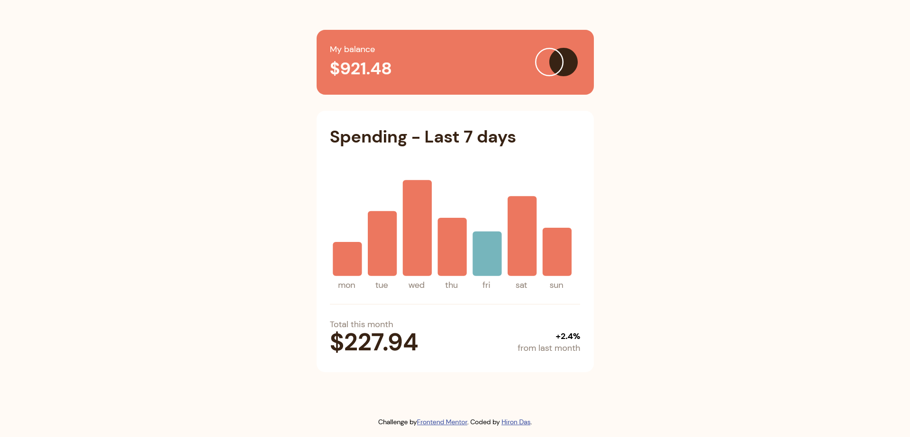
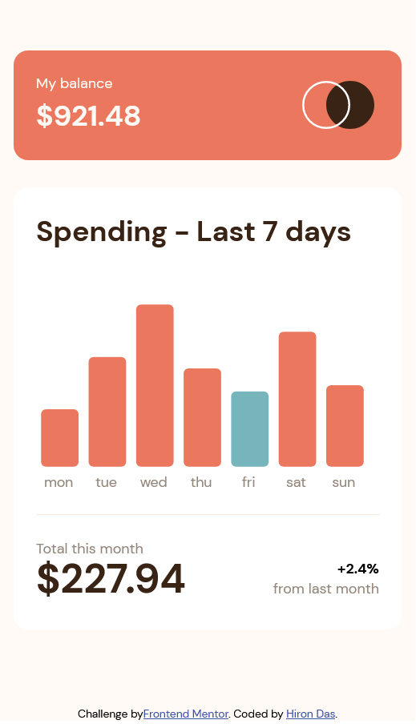

# Frontend Mentor - Expenses chart component solution

This is a solution to the [Expenses chart component challenge on Frontend Mentor](https://www.frontendmentor.io/challenges/expenses-chart-component-e7yJBUdjwt). Frontend Mentor challenges help you improve your coding skills by building realistic projects. 

## Table of contents

- [Overview](#overview)
  - [The challenge](#the-challenge)
  - [Screenshot](#screenshot)
  - [Links](#links)
- [My process](#my-process)
  - [Built with](#built-with)
  - [What I learned](#what-i-learned)
  - [Continued development](#continued-development)
- [Author](#author)

**Note: Delete this note and update the table of contents based on what sections you keep.**

## Overview

### The challenge

Users should be able to:

- View the bar chart and hover over the individual bars to see the correct amounts for each day
- See the current day’s bar highlighted in a different colour to the other bars
- View the optimal layout for the content depending on their device’s screen size
- See hover states for all interactive elements on the page
- **Bonus**: Use the JSON data file provided to dynamically size the bars on the chart

### Screenshot

### Links

- Solution URL: [Github](https://github.com/HironDas/fem-expenses-chart-component)
- Live Site URL: [Github Page](https://hirondas.github.io/fem-expenses-chart-component)

## My process

### Built with

- Semantic HTML5 markup
- SASS
- [BEM METHODOLOGY](https://en.bem.info/methodology/) - A component-based approach for styling pages
- Flexbox
- desktop-first workflow
- [Solid ](https://www.solidjs.com/) - JS library
- [StoryBook](https://storybook.js.org/) - For building UI components

### What I learned

I used solid-js, storybook, BEM, and d3-js together for the very first time where I used rem instead of px.

### Continued development

I will continue to build projects related to charts/graphs and try to continue the BEM approach to develop components.

## Author

- LinkedIn - [Hiron Das](https://www.linkedin.com/in/hiron-das/)
- Frontend Mentor - [@HironDas](https://www.frontendmentor.io/profile/HironDas)

